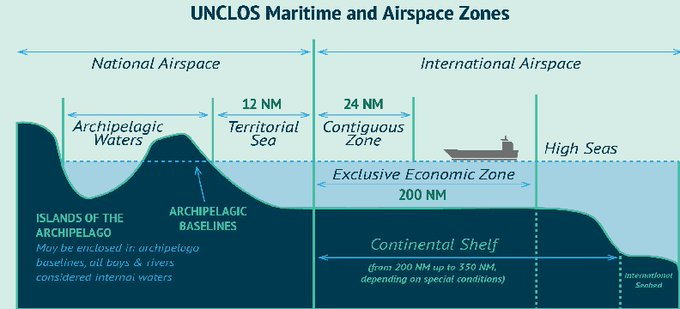

## The Law of the Sea for All Nations.
		

		
The States Parties to this Convention.

Prompted by the desire to settle, in a spirit of mutual understanding and
cooperation, all issues relating to the law of the sea and aware of the historic
significance of this Convention as an important contribution to the
maintenance of peace, justice and progress for all peoples of the world,

Noting that developments since the United Nations Conferences on the
Law of the Sea held at Geneva in 1958 and 1960 have accentuated the need
for a new and generally acceptable Convention on the law of the sea,
Conscious that the problems of ocean space are closely interrelated and
need to be considered as a whole,

Recognizing the desirability of establishing through this Convention,
with due regard for the sovereignty of all States, a legal order for the seas and
oceans which will facilitate international communication, and will promote
the peaceful uses of the seas and oceans, the equitable and efficient utilization
of their resources, the conservation of their living resources, and the study,
protection and preservation of the marine environment,

Bearing in mind that the achievement of these goals will contribute to
the realization of a just and equitable international economic order which
takes into account the interests and needs of mankind as a whole and, in
particular, the special interests and needs of developing countries, whether
coastal or land-locked,

Desiring by this Convention to develop the principles embodied in
resolution 2749 (XXV) of 17 December 1970 in which the General Assembly
of the United Nations solemnly declared inter alia that the area of the seabed
and ocean floor and the subsoil thereof, beyond the limits of national
jurisdiction, as well as its resources, are the common heritage of mankind, the
exploration and exploitation of which shall be carried out for the benefit of
mankind as a whole, irrespective of the geographical location of States,

Believing that the codification and progressive development of the law
of the sea achieved in this Convention will contribute to the strengthening of
peace, security, cooperation and friendly relations among all nations in
conformity with the principles of justice and equal rights and will promote the
economic and social advancement of all peoples of the world, in accordance
with the Purposes and Principles of the United Nations as set forth in the
Charter,

Affirming that matters not regulated by this Convention continue to be
governed by the rules and principles of general international law,

	

UNCLOS and its relation with IMO


